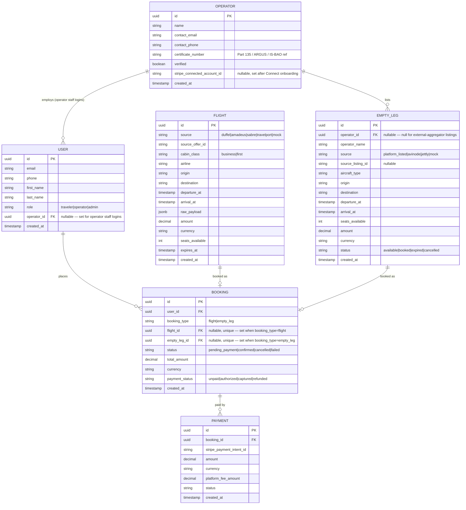

# Database Schema (ERD)

PostgreSQL, modeled with Prisma (`apps/api/prisma/schema.prisma` is the
source of truth). Five core entities as requested — `User`, `Booking`,
`Flight`, `EmptyLeg`, `Operator` — plus `Payment`, which any booking flow
needs.

## Notes on the design

- **`Booking` references exactly one of `flightId` / `emptyLegId`.**
  Prisma has no native "exactly one of two nullable FKs" constraint, so
  this is enforced in `BookingService` (`bookFlight` vs. `bookEmptyLeg`
  are separate methods, each setting only their own FK) rather than in
  the schema. If you outgrow two booking types, revisit this as a
  polymorphic `bookable_type`/`bookable_id` pair.
- **`Flight` is a cache, not authoritative inventory.** It's the priced
  snapshot returned from a provider search, with the provider's own
  `expiresAt` copied over — `BookingService.bookFlight` refuses to book
  an expired one. This is why `Flight` has a `rawPayload` JSONB column:
  it preserves exactly what the provider returned for later audit/dispute
  handling, even after the provider's own offer has expired.
- **`EmptyLeg` is a real table you own, not just a cache** — unlike
  `Flight`, this is authoritative inventory for `platform_listed` rows
  (an Operator's own listing lives here permanently, not just for the
  duration of a search). Its `status` transitions
  `available → booked` inside the same DB transaction that creates the
  `Booking`, closing the double-booking race condition.
- **`Operator.stripeConnectedAccountId` is nullable** because an
  operator can register and list flights before completing Stripe
  Connect onboarding; `PaymentsService` only attempts a split payout once
  it's set, otherwise the platform simply collects the full amount (settle
  with the operator out-of-band until then).
- **No loyalty/markup/B2B tables in this schema.** Those were part of an
  earlier, broader "VIP travel platform" concept for this same repo. This
  brief is scoped to exactly the two products described, so those tables
  were removed rather than left half-wired; add them back deliberately if
  a future brief asks for dynamic pricing or a loyalty program again.
