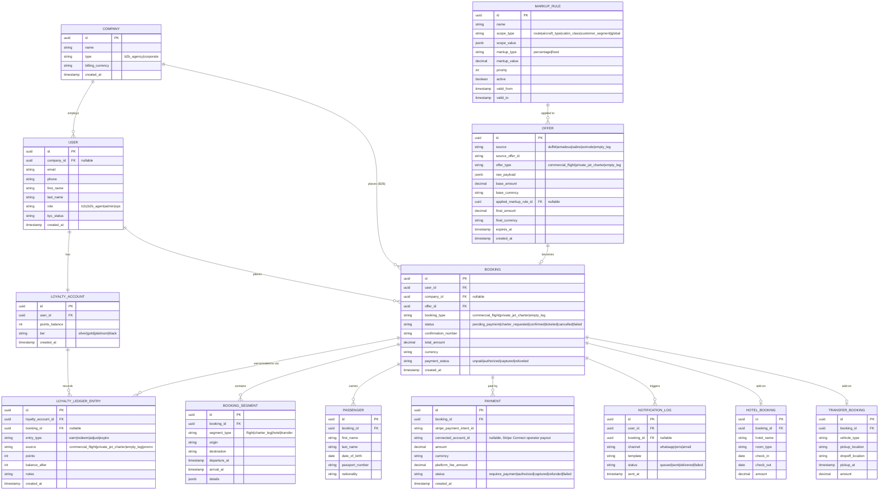

# Database Schema (ERD)

PostgreSQL, modeled with Prisma (`apps/api/prisma/schema.prisma` is the
source of truth — this doc is the human-readable view of it).

## Notes on the design

- **`OFFER` is immutable and cached, not authoritative inventory.** It's a
  priced snapshot returned from search, with a short `expires_at`. A
  `BOOKING` references the `OFFER` it was created from so pricing/markup
  is always auditable after the fact, even if the rule changes later.
- **`LOYALTY_LEDGER_ENTRY` stores a running `balance_after`** on every row
  (append-only, never update/delete) so the wallet balance is always
  reconstructable and auditable — this is the same pattern used for
  financial ledgers. `LOYALTY_ACCOUNT.points_balance` is a denormalized
  cache of the latest `balance_after`, updated in the same DB transaction.
- **`MARKUP_RULE.scope_value` is JSONB** because scope shape differs by
  `scope_type` (a route rule needs `{origin, destination}`; an aircraft
  rule needs `{aircraftType}`; a segment rule needs `{customerSegment}`).
  Rules are evaluated in `priority` order and the pricing engine documents
  which one won on the `OFFER` row.
- **B2B vs B2C** is not a separate schema — `COMPANY` is nullable on both
  `USER` and `BOOKING`. A B2C consumer has `company_id = null`; a travel
  agent booking on behalf of a client has `company_id` set and the actual
  traveler goes in `PASSENGER`.
- Payment sits on its own table (not embedded in `BOOKING`) because a
  booking can have multiple payment attempts (failed → retried) and, for
  charter with a connected operator, potentially split disbursement.
